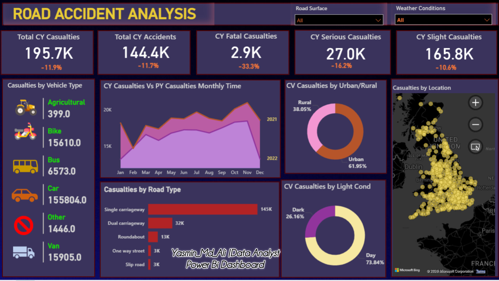

# Road Accident Analysis Dashboard

An operational safety analytics dashboard built in Power BI to analyze emergency services data, historical traffic safety, and road casualty patterns. This project identifies critical hazard trends based on vehicle types, locations, and environmental variables to support data-driven safety infrastructure planning.

## 📊 Key Metrics & Insights (Current Year vs Previous Year)
* **Total CY Casualties:** 195.7K (-11.9% YoY decrease)
* **Total CY Accidents:** 144.4K (-11.7% YoY decrease)
* **Fatal Casualties:** 2.9K (-33.3% YoY decrease)
* **Serious Casualties:** 27.0K (-16.2% YoY decrease)
* **Slight Casualties:** 165.8K (-10.6% YoY decrease)

## 📈 Features & Visualizations
* **Vehicle Type Breakdown:** Tracks casualty numbers across specific transport modes (Cars leading at 155,804, followed by Vans and Motorcycles).
* **Monthly Timeline comparison:** A dual-line trend chart comparing Current Year (CY) vs Previous Year (PY) casualties over 12 calendar months.
* **Environmental & Road Condition Metrics:** Pie and donut charts highlighting urban vs rural splits (Urban leading at 61.95%), lighting contexts (Daylight at 73.84%), and horizontal bar distributions by Road Type.
* **Geospatial Intelligence:** Interactive Bing Maps GIS visualization plotting precise geographic incident coordinates across the United Kingdom.
* **Advanced Filters:** Interactive slicers for Road Surface conditions and Weather Conditions.

## 🛠️ Tools & Technologies
* **Power BI Desktop:** Advanced DAX, Geographic Mapping, Data Transformation, and UI Theme Customization.

## 📂 How to Use
1. Download the `.pbix` file.
2. Open in **Power BI Desktop**.
3. Interact with the map view or top-right filter menus to explore specific weather and environmental hazard factors.
